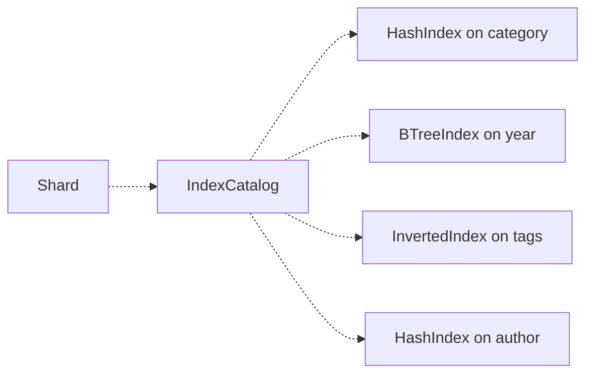
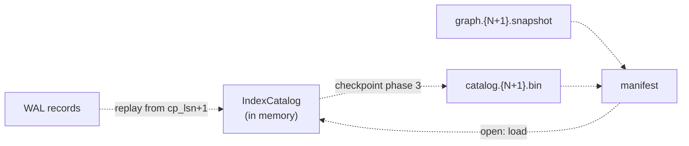
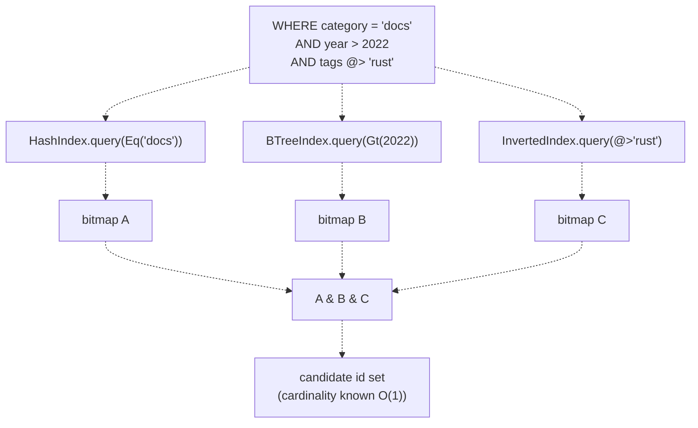

# Meta-index : secondary indexes for Kova metadata

Meta-indexes are Kova's answer to "I have a million vectors and a WHERE
clause that touches three metadata fields. I want the candidate id set
in microseconds, not by walking every row." They are the public surface
of the [`kova-meta-index`](../crates/kova-meta-index/) crate, plus a
thin layer of `Shard` glue that maintains them automatically through
every insert / delete / update.

This document is the reference. The README has the highlights ; here
is the full architecture, why each index type exists, how the catalog
orchestrates them, the persistence story, and what the next phases add.

If you are new to meta-indexes, read top-to-bottom. The first sections
give you a feel for what the indexes are and how to register them.
Then comes the architecture (catalog, persistence, replay), then the
algorithms inside each index type, then reference material.

---

## A 30-second taste

The catalog gives a shard secondary-index hooks on metadata fields.
Once you register an index on a field, the shard maintains it
automatically for every mutation, and the catalog answers
`(field, atom) -> Option<RoaringTreemap>` lookups in microseconds :

```rust
let mut shard = Shard::open("/tmp/my-shard", 768, L2, HnswParams::default())?;

shard.add_hash_index("category");
shard.add_btree_index("year");
shard.add_inverted_index("tags");

// ... inserts, deletes, updates : indexes update synchronously ...

// WHERE category = 'docs' AND year > 2022 AND tags @> 'rust'
let docs   = shard.catalog().lookup("category", &IndexAtom::Eq(s("docs")))?;
let recent = shard.catalog().lookup("year",     &IndexAtom::Cmp(CmpOp::Gt, i(2022)))?;
let rust   = shard.catalog().lookup("tags",     &IndexAtom::ArrayContains(s("rust")))?;
let candidates = docs & recent & rust;   // roaring bitmap intersection
```

That last intersection runs in microseconds even on a million-row
shard because roaring bitmaps prune entire 65,536-id chunks at a time
when they're absent from any input.

The rest of this doc unpacks that.

---

## What meta-indexes are, and what they are not

Meta-indexes give the planner cheap answers to "which ids match this
predicate atom on this field?" without scanning the metadata store.
Three index types cover the predicate space :

- **`HashIndex`** : equality (`field = X`, `field IN (...)`)
- **`BTreeIndex`** : ranges (`field < x`, `BETWEEN lo AND hi`)
- **`InvertedIndex`** : array containment (`tags @> 'rust'`)

All three return [`RoaringTreemap`] of matching `VectorId`s. The
executor (not wired into the query path today) composes them with
roaring set operations to get the candidate id set for any WHERE
clause that touches indexed fields.

What meta-indexes are **not** :

- Not vector indexes. ANN-style proximity search is HNSW's job ;
  meta-indexes are purely for metadata predicates.
- Not a query language. The trait talks about `Value` (from `kova-core`)
  and `IndexAtom` (a slim local enum), never `PredAtom` from KQL. The
  executor at the boundary translates `PredAtom` to `IndexAtom`.
- Not a planner. Cost estimation lives in `kova-query` ; this crate
  exposes `cardinality()` so the planner can compute selectivity
  fractions, but does not pick plans.
- Not a transactional log. The WAL is still the source of truth for
  mutations ; meta-indexes are derived state that gets rebuilt on
  reopen from the catalog snapshot + WAL replay.

---

## How to use it

The public surface is four `Shard` methods plus the read-only
`catalog()` accessor :

```rust
use kova_storage::Shard;
use kova_meta_index::{CmpOp, IndexAtom};
use kova_core::Value;

let mut shard = Shard::open("/tmp/my-shard", 768, L2, HnswParams::default())?;

// 1. Register indexes. Each call backfills from existing metadata.
shard.add_hash_index("category");
shard.add_btree_index("year");
shard.add_inverted_index("tags");

// 2. From here on, every Shard::insert / delete / update / update_metadata
//    keeps the catalog in sync synchronously, in phase 3 (post WAL commit).

// 3. Query through the catalog. Returns Option<RoaringTreemap> :
//    None means no index on this field, caller falls back to scan.
let bitmap = shard
    .catalog()
    .lookup("category", &IndexAtom::Eq(Value::String("docs".into())));

// 4. Compose with other bitmaps via standard roaring operators :
//    & = intersection, | = union, - = difference.

// 5. Persist across reopen by calling shard.checkpoint() before close.
//    Indexes added between checkpoints are transient.
shard.checkpoint()?;
```

`Shard::add_*_index` is idempotent-replace : calling it twice on the
same field rebuilds from scratch. The backfill walks the metadata
store once (`scan_ids` + `get` per row), so the first registration on
a large shard is O(N) ; every subsequent op is O(1) amortised.

DDL (`CREATE INDEX foo ON tags USING INVERTED`) parses but the binder
rejects it ; it isn't wired through to the catalog yet. For now, the
programmatic API above is the only way to register.

---

## The three index types

Each index implements the same `MetaIndex` trait but answers different
atom shapes. Pick the type that matches the predicate kind you expect
to see on that field.

### `HashIndex` : equality

Backing : `HashMap<NormalizedKey, RoaringTreemap>`. Each bucket holds
the ids of every row whose indexed field equals that key.

Supports :

| Atom | How |
|------|-----|
| `Eq(v)` | hash lookup, clone bucket bitmap |
| `In([v1, v2, ...])` | k hash lookups, union of k bitmaps |
| `IsNotNull` | clone the running `all_indexed_ids` bitmap |
| `Cmp(Ne, v)` | `all_indexed_ids - bucket(v)` |

Cost : O(1) lookup + O(matches) bitmap clone. Use for fields where
queries are mostly equality : category, status, user_id, etc.

### `BTreeIndex` : ranges

Backing : `BTreeMap<NormalizedKey, RoaringTreemap>`. The total ordering
on `NormalizedKey` lets range queries walk a contiguous prefix of buckets.

Supports everything `HashIndex` does, plus :

| Atom | How |
|------|-----|
| `Cmp(Lt/Le/Gt/Ge, v)` | cursor at value, range walk, union of bucket bitmaps |
| `Between(lo, hi)` | two cursors, range walk, union |

Cost : O(log N) cursor + O(buckets_in_range × union_size). Use for
time fields, scores, integer thresholds.

**Float ordering caveat.** `NormalizedKey::F64Bits` stores floats via
`f64::to_bits` for hashability + ordering. Bit-pattern ordering matches
numeric `<` for positive finite floats but diverges for mixed signs and
NaN. The `BTreeIndex` therefore rejects ranged queries on float fields
via `supports`. Equality on floats still works because it matches by
bit pattern, which is what users expect (NaN is never equal to NaN,
two distinct NaN encodings are distinct keys).

A sortable-float encoding would lift this restriction. Not in v1 ;
flagged as a future optimisation.

### `InvertedIndex` : array containment

Backing : `HashMap<NormalizedKey, RoaringTreemap>`, same shape as
`HashIndex`, but the semantics differ. For a row with metadata
`{"tags": ["a", "b", "c"]}`, the row's id ends up in the buckets for
`"a"`, `"b"`, AND `"c"`. The query `tags @> 'b'` returns the `"b"`
bucket directly.

Supports :

| Atom | How |
|------|-----|
| `ArrayContains(v)` | hash lookup, clone bucket bitmap |
| `IsNotNull` | clone `all_indexed_ids` |

Multi-tag predicates like `tags @> 'a' AND tags @> 'b'` are handled
by the executor : two queries against this index, then bitmap
intersection. The index itself only answers single-element containment.

Cost at query time : same as `HashIndex` (O(1) lookup). Cost at
insert/delete : O(array_length) per row because the same id is threaded
into one bucket per array element. That's the price for cheap
containment queries.

Empty arrays `[]` are treated as "indexed but in no bucket" : the row
joins `all_indexed_ids` (so `IsNotNull` sees it) but no `ArrayContains`
query matches it. Matches SQL and Mongo semantics for empty arrays.

### When to use which

A single field can carry multiple index types. The catalog routes
each atom to whichever index supports it cheapest :

```
WHERE category = 'docs'          -> HashIndex
WHERE year BETWEEN 2020 AND 2024 -> BTreeIndex
WHERE tags @> 'rust'             -> InvertedIndex
```

For an equality-only field, pick `HashIndex` (it's faster than
`BTreeIndex` for equality and avoids the float gate). For a field that
sees both equality and ranges, register both : `add_hash_index("year")
+ add_btree_index("year")`. The catalog routes `Eq` to the hash and
`Cmp/Between` to the btree.

---

The three indexes are the algorithmic building blocks. The rest of the
doc explains how they compose into one catalog, how that catalog
survives across reopens, and how the WAL keeps everything coherent.

## The catalog at a glance



Each shard owns one `IndexCatalog`. The catalog maps a **field name**
to a `FieldIndexes` bundle holding up to three index types
(`Option<HashIndex>`, `Option<BTreeIndex>`, `Option<InvertedIndex>`)
on that field.

The catalog has four jobs :

1. **Register indexes** : `add_hash_index(field)` / `add_btree_index(field)`
   / `add_inverted_index(field)`, idempotent-replace.
2. **Forward mutations** : `on_insert(id, &Metadata)` / `on_delete(id, &Metadata)`
   / `on_update(id, &old, &new)` walks every indexed field present in the
   metadata bag and updates the corresponding index types.
3. **Route lookups** : `lookup(field, &IndexAtom) -> Option<RoaringTreemap>`
   asks each index on the field in priority order (hash > btree > inverted),
   returns the first one whose `supports(atom)` is true.
4. **Persist** : `encode()` / `decode()` / `load()` serialize the whole
   catalog (including bitmap state) via bincode. The shard writes
   `catalog.{snapshot_id}.bin` at every checkpoint.

The shard's `Shard::insert` / `delete` / `update_metadata` paths call
`catalog.on_insert` / etc. in phase 3, after the WAL commit. The catalog
itself is in-memory between checkpoints ; persistence happens only at
checkpoint time.

## The persistence story



The catalog file is **generation-numbered the same way the graph
snapshot is**. At checkpoint, both `graph.{N+1}.snapshot` and
`catalog.{N+1}.bin` are atomic-written (tmp + fsync + rename + dirsync)
alongside each other ; the manifest commit is the single durable point
that swaps the live generation.

On reopen :

1. Load manifest -> `(snapshot_id, checkpoint_lsn)`.
2. Load `graph.{snapshot_id}.snapshot` into the HNSW index.
3. Load `catalog.{snapshot_id}.bin` into a fresh `IndexCatalog`
   (None if the file's missing : no checkpoint had registered indexes yet).
4. `cleanup_orphan_snapshots` AND `cleanup_orphan_catalogs` sweep
   stale generation files from previous runs.
5. Construct the shard with all three loaded.
6. Replay WAL from `checkpoint_lsn + 1` ; each record forwards into
   `catalog.on_insert` / `on_delete` / `on_update` to bring it up to
   the current LSN.

The atomic commit point covers both files : crash before manifest
commit leaves the old generation live (new files are orphans for next
open to sweep), crash after leaves the new generation live (old files
get swept).

### Indexes added after the last checkpoint are transient

This is the contract that took the longest to settle. The rule :

> Indexes registered with `add_*_index` are transient until the next
> `checkpoint`. Indexes added between checkpoints survive only in memory.

So if you :

1. Open shard.
2. `add_hash_index("category")` and insert 1M rows.
3. Close without checkpoint.
4. Reopen.

Your `add_hash_index` and all the index work are gone from disk. The
**data** is fine (in WAL + metadata.bin), but you have to call
`add_hash_index("category")` again ; `backfill_field` rebuilds the
index from the metadata store. Same contract `vacuum()` already has :
"transient until the next checkpoint locks it in."

Why this rule, not "persist on every `add_*_index`" :

The catalog file is named by `snapshot_id`. `snapshot_id` only changes
at checkpoint. So overwriting `catalog.{N}.bin` between checkpoints
creates an LSN mismatch : the file would carry state past `checkpoint_lsn`,
and on reopen the WAL replay (which starts at `checkpoint_lsn + 1`)
would re-apply records the catalog already saw, double-counting.

A watermark LSN inside the catalog file would fix this but means a
third atomic commit point (catalog + graph + manifest). Not worth the
complexity for the use case it serves. Tying durability to checkpoint
matches the existing rule for vacuum and keeps the model simple.

### WAL records carry old metadata

The WAL `Delete` and `UpdateMetadata` records used to carry only the
affected id, plus (for `UpdateMetadata`) the new bag. That worked fine
for the metadata store because the store either drops the row entirely
(`Delete`) or overwrites the bag wholesale (`UpdateMetadata`).

It does **not** work for the catalog. The catalog needs the row's OLD
metadata bag to clear the right buckets, and on reopen the metadata
store has already been overwritten (it persists eagerly), so
`metadata.get(id)` during replay returns either `None` or the new bag,
never the old one.

The fix : the WAL records carry the old bag :

```rust
Record::Delete {
    id: VectorId,
    old_metadata: Metadata,   // captured at delete time
}

Record::DeleteMany {
    items: Vec<(VectorId, Metadata)>,   // per-id (id, old_bag)
}

Record::UpdateMetadata {
    id: VectorId,
    old_metadata: Metadata,   // captured pre-update
    metadata: Metadata,       // post-update (the new bag)
}
```

The live path snapshots the bag before WAL append, embeds it in the
record, and proceeds with the existing 3-phase ordering. Replay reads
the bag straight out of the record without depending on the (mutated)
store. The record becomes self-sufficient.

This is a WAL format change. Pre-existing WAL files from earlier
revisions would fail to deserialize. For pre-release, that's
acceptable ; when v1 ships, a `Record` version bump with backward-compat
fallback would handle migration.

---

## Algorithms : roaring bitmaps and atom dispatch

The two pieces of non-trivial machinery in this crate are roaring
bitmap composition and the catalog's per-field routing. Everything
else is plumbing.

### Why roaring bitmaps

Naive bitmaps for a million id space allocate a million bits regardless
of how few ids are in the set : 125 KB to represent 50 numbers in a
1B-id space, unworkable for sparse sets.

Roaring bitmaps chop the id space into 65,536-id chunks. For each
chunk, they pick the **best representation** based on density :

```
chunk 0x0042 has 3 ids   -> store as a sorted u16 array [42, 100, 50000]
chunk 0x0043 has 60000 ids -> store as a dense bitmap (8 KB)
chunk 0x0044 has run [10..40000] -> store as a (start, length) run
chunk 0x0045 has 0 ids -> don't store the chunk at all
```

Three container types : **array** (sparse), **bitmap** (dense), **run**
(consecutive ranges). The container per chunk is chosen by a small
density heuristic and converted on the fly when crossings happen.

The wins compound :

- Sparse sets cost ~2 bytes per id (the u16 in the array).
- Dense sets cost 1 bit per id (the bitmap).
- Run-length sets cost 4 bytes per run regardless of run length.
- Empty chunks cost nothing.
- Set operations work at the chunk level : intersecting two bitmaps
  walks the two chunk lists in lockstep, skipping any chunk only one
  of them has.

For Kova specifically, `VectorId` is a u64 newtype around u64, so the
bitmap type is `RoaringTreemap`, which is a `BTreeMap<u32, RoaringBitmap>`
where the upper 32 bits of each id pick a `RoaringBitmap` from the
btree and the lower 32 bits get stored inside it. Every roaring
operation decomposes : intersection walks both btrees in sync,
intersecting matching inner bitmaps for each shared upper-32 chunk.

### Composition cost in practice



Three index lookups, two intersections, one bitmap output.

The intersection is where roaring earns its name. Naive set
intersection walks every id in the smallest input and looks each up in
the others. Roaring walks all three bitmaps chunk-by-chunk
(65k id range at a time) :

```
chunks in A: [0x0000, 0x0001, 0x0003, 0x0007, 0x000A, ...]
chunks in B: [0x0001, 0x0002, 0x0003, 0x0005, 0x0007, ...]
chunks in C: [0x0003, 0x0007, 0x000A, 0x000F, ...]

intersection walk:
  - chunk 0x0000: only in A, skip
  - chunk 0x0001: in A and B but not C, skip
  - chunk 0x0002: only in B, skip
  - chunk 0x0003: in all three -> intersect the three containers
  - chunk 0x0005: only in B, skip
  - chunk 0x0007: in all three -> intersect the three containers
  ...
```

Most chunks get skipped without ever touching individual ids. The
per-chunk intersection picks the fastest method based on container
types involved : array ∩ array = sorted merge, bitmap ∩ bitmap =
SIMD popcount loop, array ∩ bitmap = scan array against bitmap. The
inner loops are vectorisable.

### The catalog's per-field routing

`IndexCatalog::lookup(field, &atom)` dispatches in three steps :

1. Look up `field` in `fields: HashMap<String, FieldIndexes>`.
   Missing -> `None`.
2. Walk the `FieldIndexes` bundle in priority order :
   - Try `HashIndex` first (cheapest equality lookups).
   - Try `BTreeIndex` second (ranges plus everything hash does).
   - Try `InvertedIndex` last (only array containment).
3. For each present index, call `supports(atom)`. Return the first
   index's `query(atom)` result.

Returns `None` if no index on the field can answer the atom. The
caller (executor) interprets `None` as "fall back to a metadata scan."

The priority order is by **lookup cost**, not by **selectivity**. All
supporting indexes return the same bitmap for the same atom ; picking
the cheapest minimises overhead. A future cost-based router could
swap in selectivity-driven routing if it pays off.

### Cardinality without doing the lookup

`IndexCatalog::estimate(field, &atom) -> Option<u64>` is the same
dispatch but returns the bucket size instead of cloning the bitmap.
The planner uses it to estimate selectivity for the three-plan dispatch
(plan A/B/C in `query.md`) without actually materialising the candidate
set.

For HashIndex and BTreeIndex, `cardinality` is **exact** because each
id is in at most one bucket per index (a row has one value for an
indexed field) ; sum-of-bucket-lengths equals union cardinality.

For InvertedIndex, `cardinality` is exact for single-element
`ArrayContains` but would be an overestimate for a hypothetical
multi-element atom because the same id can appear in multiple buckets
(once per array element). The catalog dodges this by not exposing
multi-element containment as a single atom ; the executor composes
two separate single-element queries and intersects.

For unsupported atoms or unindexed fields, `estimate` returns `None` :
"I can't tell you cheaply, go ask the data."

---

## Layer 4 : the WAL coherence story

The shard's `replay_from(lsn)` runs every WAL record `>= lsn` through
the same apply path that live ops use. For meta-indexes that means :

| Record kind | Replay behaviour |
|-------------|------------------|
| `Insert { id, vector, metadata }` | `index.insert(id, vector)` + `catalog.on_insert(id, &metadata)` + `metadata.put(id, metadata)` |
| `Delete { id, old_metadata }` | `index.tombstone(id)` + `metadata.delete(id)` + `catalog.on_delete(id, &old_metadata)` |
| `DeleteMany { items }` | per-`(id, old_metadata)` pair, same as `Delete` |
| `UpdateMetadata { id, old_metadata, metadata }` | `catalog.on_update(id, &old_metadata, &metadata)` + `metadata.put(id, metadata)` |

The ordering for `Delete` mirrors the live path exactly : the catalog
sees the bag from the WAL record, not from the (already-mutated) store.
Live ops capture the bag pre-mutation and embed it in the record ;
replay reads it back. Same code shape both directions.

For `UpdateMetadata` the catalog uses `(old, new)` straight from the
record. `on_update` internally handles each indexed field's four
presence cases :

| old presence | new presence | catalog action |
|--------------|--------------|----------------|
| Some(o) | Some(n) | `update(id, o, n)` on each index for that field |
| Some(o) | None | `delete(id, o)` |
| None | Some(n) | `insert(id, n)` |
| None | None | noop |

That's the whole replay coherence story.

---

## Layer 5 : `NormalizedKey`, the value-to-key bridge

Three concerns motivate this type :

1. `Value` cannot be a `HashMap` key because `Value::F64` contains
   `f64`, which is not `Eq` (NaN).
2. `Value` cannot be a `BTreeMap` key for the same reason (`Ord`
   requires `Eq`).
3. The non-scalar variants (`Value::Array`, `Value::Map`) do not have
   a single canonical key shape for indexing, so they are excluded
   from being keys at all.

`NormalizedKey` solves all three :

```rust
pub enum NormalizedKey {
    String(String),    // UTF-8
    I64(i64),          // signed 64-bit
    F64Bits(u64),      // IEEE 754 bit pattern
    Bool(bool),
}

impl NormalizedKey {
    pub fn from_value(v: &Value) -> Option<Self> {
        match v {
            Value::String(s) => Some(NormalizedKey::String(s.clone())),
            Value::I64(n)    => Some(NormalizedKey::I64(*n)),
            Value::F64(f)    => Some(NormalizedKey::F64Bits(f.to_bits())),
            Value::Bool(b)   => Some(NormalizedKey::Bool(*b)),
            Value::Array(_) | Value::Map(_) => None,
        }
    }
}
```

Floats round-trip via `to_bits` (which is total over `f64`). Arrays
and maps return `None` ; `HashIndex` and `BTreeIndex` skip non-keyable
values silently, `InvertedIndex` accepts `Value::Array` at the top level
and applies `from_value` per element.

The float ordering caveat lives here : `f64::to_bits` ordering matches
numeric ordering only for positive finite floats. `BTreeIndex::supports`
checks `is_float(v)` for ranged atoms and refuses them, so the
catalog routes float ranges back as `None` (caller falls back to scan).

---

## Reference

### IndexAtom (the executor-facing predicate atom)

```rust
pub enum IndexAtom {
    Eq(Value),                          // field = value
    Cmp(CmpOp, Value),                  // field <op> value
    In(Vec<Value>),                     // field IN (...)
    Between(Value, Value),              // field BETWEEN lo AND hi (inclusive)
    IsNotNull,                          // field IS NOT NULL
    ArrayContains(Value),               // field @> value
}

pub enum CmpOp {
    Lt, Le, Gt, Ge, Ne,
}
```

`IndexAtom` is a slim view of `kova_query::logical::PredAtom`. The
distinction matters because indexes are reusable infrastructure that
must not depend on KQL. The executor translates `PredAtom` to
`IndexAtom` at the boundary.

### supports / query / cardinality matrix

| Atom | HashIndex | BTreeIndex | InvertedIndex |
|------|-----------|------------|---------------|
| `Eq(v)` | yes | yes | no |
| `In(vs)` | yes | yes | no |
| `IsNotNull` | yes | yes | yes |
| `Cmp(Ne, v)` | yes | yes | no |
| `Cmp(Lt/Le/Gt/Ge, v)` | no | yes if `v` not float | no |
| `Between(lo, hi)` | no | yes if neither is float | no |
| `ArrayContains(v)` | no | no | yes |

For unsupported atoms, `query` returns an empty bitmap and `cardinality`
returns `None`. The planner is expected to check `supports` first ;
the empty-bitmap fallback exists to make misuse fail loudly rather
than silently return the wrong answer.

### The MetaIndex trait

```rust
pub trait MetaIndex: Send + Sync {
    fn build<I>(&mut self, rows: I) where I: IntoIterator<Item=(VectorId, Value)>;
    fn insert(&mut self, id: VectorId, value: &Value);
    fn delete(&mut self, id: VectorId, value: &Value);
    fn update(&mut self, id: VectorId, old: &Value, new: &Value);
    fn query(&self, atom: &IndexAtom) -> RoaringTreemap;
    fn cardinality(&self, atom: &IndexAtom) -> Option<u64>;
    fn len(&self) -> u64;
    fn is_empty(&self) -> bool { self.len() == 0 }
    fn supports(&self, atom: &IndexAtom) -> bool;
}
```

`update` is a first-class method, not `delete + insert`. Each impl can
short-circuit when `old` and `new` normalise to the same key (an
`UPDATE SET unrelated_field = ...` that doesn't touch this index gets
a noop). The default-derived behaviour is `delete(old) ; insert(new)` ;
HashIndex and BTreeIndex implement the short-circuit explicitly.

### Error model

`KovaMetaIndexError` (in `kova-meta-index`) carries the catalog I/O
and atom-shape errors :

| Variant | When |
|---------|------|
| `Io(io::Error)` | Read/write failure on `catalog.{N}.bin` |
| `BadMagic` | File doesn't start with `KOVAIDX1` |
| `UnsupportedVersion { expected, got }` | Version field doesn't match this build |
| `Truncated { bytes, min }` | File shorter than the fixed header |
| `Decode(bincode::Error)` | Bincode rejected the payload |
| `NonIndexableValue { kind }` | (reserved) row carries a Map/Array where a scalar is expected |
| `UnsupportedAtom { atom_kind }` | (reserved) planner bypassed `supports` |

`Shard::open` surfaces catalog load failures via `ShardError::Backend`.
A corrupt catalog file aborts the open rather than silently rebuilding,
on the principle that the operator should see what's wrong before they
choose how to recover.

---

## What's shipped, and what isn't

What this gives you today :

- **Three index types**, each with their own test surface (10 + 19 +
  12 unit tests) and shared invariants (exact cardinality,
  supports/query symmetry).
- **Catalog orchestration** with priority routing, per-field bundles,
  and 17 unit + 12 integration tests.
- **Persistence**, end to end : catalog file generation-numbered
  alongside the graph snapshot, atomic write through the manifest's
  commit, restored on open, post-checkpoint records replay through
  the catalog's hooks. 8 integration tests across close/reopen,
  checkpoint succession, orphan cleanup, post-checkpoint replay,
  durability contract.
- **WAL format carries old metadata** in `Delete` / `UpdateMetadata` /
  `DeleteMany`. Live + replay paths use the same `(old, new)` data,
  no asymmetry between them.

What it does **not** give you today :

- **Speedup for actual KQL queries.** The executor still walks every
  row in `MetadataScan` ; teaching it to consult
  `shard.catalog().lookup` first is the next concrete step.
- **DDL surface.** `CREATE INDEX foo ON tags USING INVERTED` parses
  but the binder rejects it. For now `Shard::add_*_index` is the
  only way to register.
- **Stats on unindexed fields.** The catalog gives exact selectivity
  for indexed atoms ; unindexed predicates have nothing for the
  planner to estimate against, so it falls back to a sampling scan.

The next concrete steps, in the order they need to happen :

1. Wire the executor's `MetadataScan` to consult the catalog before
   scanning. This is where the bitmap-compose machinery pays off in
   actual query latency.
2. Unreject `CREATE INDEX` / `DROP INDEX` at the binder and dispatch
   them to `Shard::add_*_index` / a future `Shard::drop_index`.
3. Add column statistics for unindexed fields so the cost model has
   something to estimate against where the catalog is silent.
4. Replace the planner's hardcoded selectivity bands with a real
   cost model that reads the stats + catalog cardinality.
5. Publish latency baselines alongside the existing recall sweep.

---

## Caveats and load-bearing constraints

**Durability is checkpoint-gated.** Indexes added after the last
checkpoint are transient. This matches the `vacuum()` contract and
keeps the persistence model simple. The trade : you have to call
`shard.checkpoint()` after `add_*_index` if you want it to survive
reopen.

**Float ranges are rejected by `BTreeIndex`.** `f64::to_bits` ordering
diverges from numeric ordering for mixed signs and NaN. Float
equality works (bit-pattern match), float ranges fall back to scan.
Lift via a sortable-float encoding when it pays off.

**WAL format is current-revision only.** `Record::Delete /
DeleteMany / UpdateMetadata` carry `old_metadata` now. Pre-revision
WAL files won't deserialize. A version bump on the `Record` framing
would handle migration ; not in place today.

**InvertedIndex insert cost is `O(array_length)`.** Each array
element makes one bucket lookup + insert. Rows with very wide arrays
(thousands of tags) pay proportionally. The win is `O(1)` query time
on those buckets, so the trade is "amortise insert cost for query
latency", which is the right side of the curve for most workloads.

**Catalog load failure aborts open.** A truncated or corrupt
`catalog.{N}.bin` produces `ShardError::Backend` from `Shard::open`,
not a silent rebuild. The principle : the operator should see what's
wrong and decide. A rebuild-on-corrupt fallback can land later if
operators want it.

**No corruption recovery for the catalog file itself.** The WAL has
CRC framing per record so partial writes are detected. The catalog
has a magic header + version + bincode payload, no per-record CRC.
A torn write would be detected at decode time (bincode would fail
on a truncated payload), but the file as a whole is all-or-nothing.
Atomic-write via temp + rename means a torn write can only happen
on hardware failure mid-fsync ; in that case the previous
generation's `catalog.{N}.bin` is still on disk because cleanup is
best-effort.

---

## Pointers

| What | Where |
|------|-------|
| `MetaIndex` trait + `IndexAtom` / `CmpOp` / `NormalizedKey` | [`lib.rs`](../crates/kova-meta-index/src/lib.rs) |
| `HashIndex` | [`hash.rs`](../crates/kova-meta-index/src/hash.rs) |
| `BTreeIndex` | [`btree.rs`](../crates/kova-meta-index/src/btree.rs) |
| `InvertedIndex` | [`inverted.rs`](../crates/kova-meta-index/src/inverted.rs) |
| `IndexCatalog` + `FieldIndexes` + persistence | [`catalog.rs`](../crates/kova-meta-index/src/catalog.rs) |
| `KovaMetaIndexError` | [`error.rs`](../crates/kova-meta-index/src/error.rs) |
| `Shard::add_*_index` / `catalog()` / `backfill_field` | [`shard/mod.rs`](../crates/kova-storage/src/shard/mod.rs) |
| Catalog write at checkpoint | [`shard/checkpoint.rs`](../crates/kova-storage/src/shard/checkpoint.rs) |
| Catalog load on open + orphan cleanup | [`shard/open.rs`](../crates/kova-storage/src/shard/open.rs) |
| WAL Record format with `old_metadata` | [`wal/record.rs`](../crates/kova-storage/src/wal/record.rs) |
| Integration tests | [`tests/meta_index_integration.rs`](../crates/kova-storage/tests/meta_index_integration.rs) [`tests/meta_index_persistence.rs`](../crates/kova-storage/tests/meta_index_persistence.rs) |
