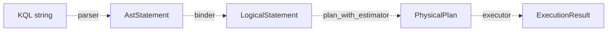
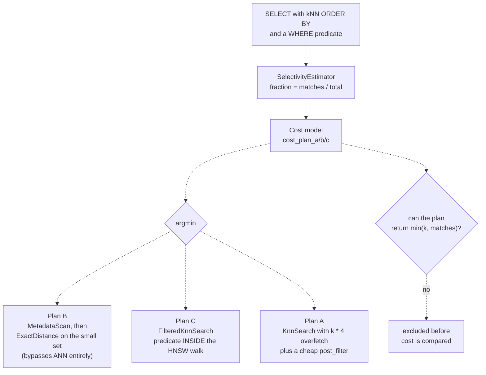
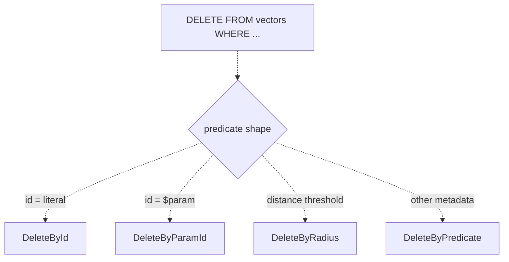
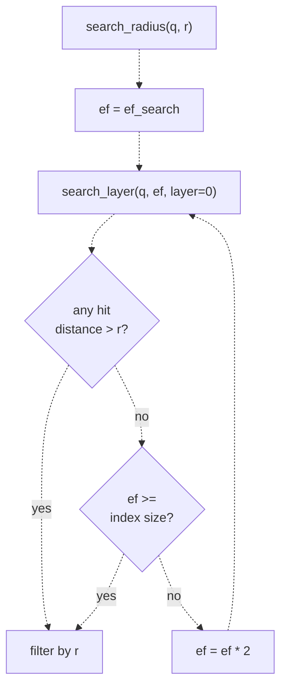
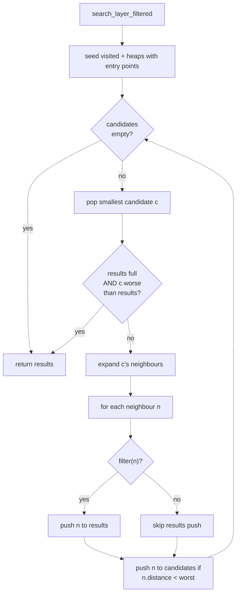
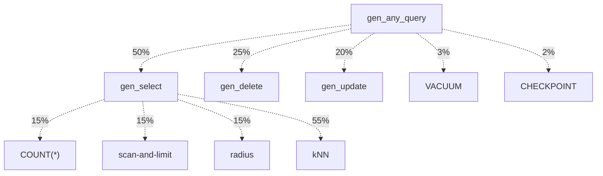

# KQL : the query language for Kova

KQL is the SQL-shaped query language Kova ships for hybrid vector +
metadata workloads. It is the public surface of the [`kova-query`](../crates/kova-query/)
crate. Everything user-visible goes through the same parse -> bind ->
plan -> execute pipeline, including DDL, DML, management ops, and
reads.

This document is the reference. The README has the highlights ; here
is the full architecture, the design choices, what ships today,
and what's still in flight.

If you are new to KQL, read top-to-bottom. The first few sections
are a guided tour : a 30-second taste, then a quick start you can
copy, then the queries you will actually write day to day. Once you
have a feel for the language, the middle of the doc opens up the
pipeline and the algorithms underneath. The reference material
(types, full statement coverage, result shapes) lives near the end,
and the closing sections cover how we know it works and what
remains.

---

## A 30-second taste

KQL lets you write one query that does kNN search and metadata
filtering together, and have the database figure out the right
strategy :

```sql
SELECT id, embedding <-> $q AS dist
FROM vectors
WHERE category = 'docs' AND year >= 2024
ORDER BY embedding <-> $q LIMIT 10
```

That one statement finds the 10 vectors closest to `$q`, restricted
to rows where `category = 'docs' AND year >= 2024`. Without KQL you
would do the ANN search and the metadata filter in two separate
calls, glue the results together in application code, and hope you
got the order right. With KQL, the planner picks one of three
execution strategies based on how selective your predicate is, and
hands you back the answer.

That is the elevator pitch. The rest of this doc unpacks it.

---

## What KQL is, and what it is not

KQL gives you a way to express "find the k nearest vectors to a query,
among rows that match a metadata predicate," without you having to
hand-write the planner. Everything from `SELECT COUNT(*)` to
`UPDATE vectors SET attrs['country'] = 'IN'` to
`DELETE FROM vectors WHERE embedding <-> $q < 0.5 AND category = 'old'`
is the same language, the same parser, the same executor.

It is **not** general-purpose SQL. There is exactly one table
(`vectors`), there are no JOINs, no subqueries, no window functions,
no transactions across statements. The constraints are deliberate :
the workloads vector databases serve do not need those, and shedding
them keeps the planner small enough to fit in your head.

---

## How to use it

The full public surface is exactly one type plus its `execute_str`
method :

```rust
use kova_core::{L2, Metadata, Vector, VectorId, Value};
use kova_index::HnswParams;
use kova_storage::Shard;
use kova_query::{Engine, ExecutionResult, ParamBindings, ParamValue, RowValue};

// 1. Open a shard, wrap it in an Engine. Engine is generic over the
//    distance metric ; the table name is the symbolic name KQL uses.
let shard = Shard::open("/tmp/my-shard", /*dim*/ 4, L2, HnswParams::default())?;
let mut engine = Engine::new(shard, "vectors");

// 2. Seed some data through the Engine. Single inserts go through
//    `INSERT INTO ... VALUES`. Batches go through the batch-param shape.
engine.execute_str(
    "INSERT INTO vectors (id, embedding, metadata) VALUES ($1, $2, $3)",
    ParamBindings::empty()
        .with_positional(ParamValue::Id(VectorId::new(1)))
        .with_positional(ParamValue::Vector(Vector::try_new(vec![1.0, 0.0, 0.0, 0.0])?))
        .with_positional(ParamValue::Metadata({
            let mut m = Metadata::new();
            m.insert("category".into(), Value::String("docs".into()));
            m
        })),
)?;

// 3. Run a kNN query. Parameters bind by position.
let query_vec = Vector::try_new(vec![1.0, 0.0, 0.0, 0.0])?;
let result = engine.execute_str(
    "SELECT id, embedding <-> $1 AS distance \
     FROM vectors \
     WHERE category = 'docs' \
     ORDER BY embedding <-> $1 LIMIT 10",
    ParamBindings::empty().with_positional(ParamValue::Vector(query_vec)),
)?;

// 4. Pattern-match on the result. Rows is the SELECT shape ; the
//    Delete / Update / Count / Insert / Vacuum / Checkpoint shapes
//    have their own variants.
let ExecutionResult::Rows { columns, rows } = result else {
    panic!("expected Rows");
};
for row in rows {
    let RowValue::Id(id) = row.values[0] else { continue; };
    let RowValue::Distance(d) = row.values[1] else { continue; };
    println!("id={} distance={:.3}", id.get(), d);
}
```

Named params work the same way :

```rust
let params = ParamBindings::empty()
    .with_named("q", ParamValue::Vector(query_vec))
    .with_named("cutoff", ParamValue::F64(0.5));

engine.execute_str(
    "SELECT id FROM vectors WHERE embedding <-> $q < $cutoff",
    params,
)?;
```

`ParamBindings` is a builder ; positional and named slots coexist in
the same call. Every public KQL example in this doc is one
`execute_str` call away from running.

---

## The queries you will actually write

If you only learn five query shapes, learn these. They cover most of
what real workloads look like.

### kNN with a metadata filter

The bread and butter. "Find me the 10 most similar `$q`, but only
among `docs` from 2024 onward."

```sql
SELECT id, embedding <-> $q AS dist
FROM vectors
WHERE category = 'docs' AND year >= 2024
ORDER BY embedding <-> $q LIMIT 10
```

The planner picks plan A, B, or C automatically depending on how
many rows match the WHERE clause. You do not need to think about it.

### Radius search

"Everything within distance 0.5, no top-k cap."

```sql
SELECT id FROM vectors
WHERE embedding <-> $q < 0.5 AND tag = 'archived'
```

Note that this has no `ORDER BY` and no `LIMIT`. The radius operator
is its own thing : it returns every match, no ranking required. The
`AND tag = 'archived'` is a post-filter inside the operator.

### Counting

"How many rows match this predicate?"

```sql
SELECT COUNT(*) FROM vectors WHERE attrs['country'] = 'IN'
```

COUNT(*) bypasses the kNN path entirely. Comes back as a single row
with a single I64 cell. Note also the subscripted predicate :
`attrs['country']` looks into a nested map field.

### Targeted DML

Delete one row by id (this gets a fast path) :

```sql
DELETE FROM vectors WHERE id = 42
```

Patch a nested attribute on a known row :

```sql
UPDATE vectors SET attrs['priority'] = 5 WHERE id = $1
```

Tombstone everything matching a predicate :

```sql
DELETE FROM vectors WHERE category = 'old' AND year < 2020
```

DML by id is O(1) (single get + single put). DML by predicate scans
metadata and batches the mutations under one WAL group-commit.

### Batch insert

For ingestion, you pass the whole batch as one param :

```sql
INSERT INTO vectors VALUES $batch
```

```rust
let batch = vec![
    (VectorId::new(1), v1, m1),
    (VectorId::new(2), v2, m2),
    /* ... */
];
engine.execute_str(
    "INSERT INTO vectors VALUES $batch",
    ParamBindings::empty().with_positional(ParamValue::Batch(batch)),
)?;
```

Batched inserts share one WAL fsync and one metadata flush across
the whole batch, so the per-row cost drops sharply at any reasonable
batch size.

---

If those five shapes feel comfortable, you already know 80% of KQL.
The rest of this doc explains how that 80% is built, why the
planner picks what it picks, and how you can be sure it works.

---

You have seen the queries. The rest of the doc is for the curious :
**how the engine actually answers them.** Skip ahead to "Type system
and reference" if you only need the API. Stay with us if you want to
understand what KQL ships, and why future work will keep speeding
things up without anyone having to rewrite their queries.

The next handful of sections walk through the pipeline as a whole,
then each layer in turn, then the algorithms inside the operators.

## The pipeline at a glance



Four intermediate representations, three transformations. Each IR
has one job, each transformation is independently testable. The IRs
are :

| IR | Lives in | Purpose |
|----|----------|---------|
| `AstStatement` | [`ast.rs`](../crates/kova-query/src/ast.rs) | Syntax-faithful capture of what the user typed |
| `LogicalStatement` | [`logical.rs`](../crates/kova-query/src/logical.rs) | After field resolution, type checks, predicate normalisation |
| `PhysicalPlan` | [`physical.rs`](../crates/kova-query/src/physical.rs) | The operator tree the executor walks, with strategy choice baked in |
| `ExecutionResult` | [`executor.rs`](../crates/kova-query/src/executor.rs) | What the caller sees |

The boundaries are stable contracts. Grammar churn does not touch the
planner, planner churn does not touch the parser, and adding the
binder did not move either.

### Pipeline in code

```rust
let ast       = kova_query::parse_str(sql)?;          // parser
let logical   = kova_query::bind(ast)?;               // binder
let physical  = kova_query::plan_with_estimator(      // planner
    logical, &estimator, &params,
)?;
let result    = engine.execute(physical, &params)?;   // executor
```

`Engine::execute_str(sql, params)` wraps all four steps. Real callers
use that ; the internal pipeline is exposed for testing.

---

## Layer 1 : grammar and parser

The grammar lives in [`grammar.pest`](../crates/kova-query/src/grammar.pest)
and the parser builds the AST from a Pest parse tree. The parser is
strict about syntax and permissive about semantics. A parser cannot
type-check because it does not know what fields exist ; semantic
checks live in the binder.

Statements supported by the grammar (all 8 listed are accepted ; some
are bound but rejected at the binder for v1) :

```text
SELECT     INSERT     UPDATE     DELETE
VACUUM     CHECKPOINT
CREATE INDEX           DROP INDEX
```

Precedence inside predicates : `OR < AND < NOT < atom`. Atom kinds :

- `field = value` / `field <op> value` for the six comparison ops
- `field IN (lit, lit, ...)`
- `field BETWEEN lo AND hi`
- `field IS NULL` / `field IS NOT NULL`
- `field @> 'tag'` (array contains)
- `embedding <op> $q <cmp> radius` (distance threshold)

Where `field` is either `bare_name` or `bare_name['subscript_key']`.

Distance operators : `<->` (L2), `<=>` (cosine), `<#>` (negated inner
product, so smaller is closer).

Parameters : positional (`$1`, `$2`, ...) and named (`$query`,
`$cutoff`, ...). The binder resolves both into the same internal
slot, the executor looks them up the same way.

The grammar uses a shared `field_ref` rule across every atom kind so
subscript syntax is uniform : `WHERE attrs['key'] BETWEEN 0 AND 10`
is no different from `WHERE attrs BETWEEN 0 AND 10`.

The parser's surface is round-trip tested by the printer. Every
parse-able statement, when fed back through `print`, reparses to the
same AST. Property tests pin this.

---

## Layer 2 : binder

The binder turns an AST into a `LogicalStatement` plus a set of
loud-and-clear rejections. What it does :

1. **Field resolution.** Captures the field name plus optional
   subscript on every predicate atom, normalising the shape so
   downstream code does not branch on syntax.
2. **Predicate normalisation.** `IS NULL` becomes `NOT IsNotNull(f)`,
   `And` / `Or` get flattened across nesting, `Not` is pushed down to
   atoms.
3. **Type checks.** Embedding mutation is rejected here
   (`UPDATE SET embedding = $1` errors with a clear message ; HNSW
   nodes are not mutable). kNN ordering with `DESC` is rejected
   (kNN is ascending by definition). kNN without `LIMIT` is rejected.
4. **Single-id hint detection.** `WHERE id = 42` and `WHERE id = $1`
   both get a `single_id_hint`. The planner uses this to dispatch
   `DeleteById` / `DeleteByParamId` / `UpdateById` / `UpdateByParamId`
   without re-walking the predicate tree.
5. **DDL pass-through.** `CREATE INDEX` and `DROP INDEX` flow
   through to `LogicalCreateIndex` / `LogicalDropIndex` ; the
   binder synthesises a default name when the user omitted one,
   so downstream code can assume the name is always set.

The result is a `LogicalStatement` that is guaranteed well-typed and
free of grammar-level ambiguity. Anything downstream of the binder
can assume the shape is sound.

---

## Layer 3 : planner

The planner decides **how** to execute. For DDL and management
statements the planning is one-to-one : `LogicalVacuum` becomes
`PhysicalPlan::Vacuum`, `LogicalCheckpoint` becomes
`PhysicalPlan::Checkpoint`, and so on. The interesting work is on
the read side.

### The three plans for SELECT



Three strategies, chosen by a **closed-form cost model** that
computes a predicted latency per plan and dispatches the cheapest.

**Plan A : overfetched kNN + post-filter.** Run an unfiltered kNN
with `k = user_limit * 4`, then walk the candidates and drop the ones
that fail the WHERE clause. The executor returns whatever survives,
**without retrying**. Cost A is independent of selectivity and bounded
by the fixed overfetch.

That "without retrying" is load-bearing, and for a long time this
document called it "a recall trade-off, not a latency one." Measured,
it is neither — it is a **wrong answer**. Plan A's expected yield is
`k * 4 * selectivity`, so at selectivity 0.05 with `LIMIT 10` it
returns **zero rows** while plans B and C return all ten matching ones.
See [Plan A cannot always answer](#plan-a-cannot-always-answer).

**Plan B : metadata scan + exact distance.** Walk the metadata store
for ids matching the predicate, then compute exact distance for each.
Bypasses the ANN entirely. Cost is `n * c_filter_eval` (scan everything)
plus `matches * (c_metadata_get + dim * c_distance_per_dim)` (exact
distance per match).

Plan B is the only plan that is **exact** : it scores every match, so
it always returns `min(k, matching_rows)`. Measured across 84 cells :
zero shortfalls.

**Plan C : filtered ANN.** Run an HNSW search where the predicate is
consulted **during** the graph walk. Out-of-filter nodes still route
traversal but never enter the results heap. Visit count scales by
`1 / selectivity` (clamped at `n`) : to fill a results heap that admits
one node in every `1/s`, the walk must visit roughly `ef / s` nodes.

**Plan C wins at high selectivity**, which is the opposite of what this
document used to claim ("the middle band"). The reason is plan A's
fixed 4x overfetch : sized for a filter that rejects, it does ~4x the
graph work and clones 4x the metadata bags when the filter passes most
rows. Measured, C is the fastest correct plan in **35 of 84 cells**, by
up to **3.22x**, concentrated at `s >= 0.5`.

At *low* selectivity plan C is the worst option by a wide margin : its
heap can never fill, so the walk drains the whole candidate set and
degenerates into a full scan with per-node filter overhead (measured :
11 ms at `n=10k, dim=1536, s=0.001`, against plan B's 0.35 ms).

The estimator that feeds the cost model is a trait :

```rust
trait SelectivityEstimator {
    fn estimate(&self, pred: &PredicateExpr, params: &ParamBindings)
        -> SelectivityEstimate;

    fn dim(&self) -> usize;  // vector dim, weights distance cost
}
```

The shipped `ShardEstimator` consults the secondary-index catalog
first (pure-index hits return cardinality in O(1) ; hybrid hits walk
only the indexed candidates and evaluate the residue per row), then
the column-statistics catalog for atoms covered by histograms or
top-K bags, and falls back to a metadata scan for predicates neither
layer recognises.

### Cost-based dispatch

The cost model lives in
[`cost.rs`](../crates/kova-query/src/cost.rs) and reads two
inputs : a `Workload` (selectivity, k, total_rows, dim) the planner
assembles per query, and `CostCoefficients` (five per-machine
nanosecond rates) shipped as defaults.

**The coefficients :**

| Coefficient | Meaning | Default |
|---|---|---|
| `c_hnsw_per_visit` | Visiting one HNSW node (heap ops + neighbour walk, exclusive of distance) | 100 ns |
| `c_distance_per_dim` | Per-scalar distance cost. A `dim`-vector distance costs `dim * c_distance_per_dim`. | 0.15 ns |
| `c_metadata_get` | Fetching one metadata bag **by value** : lookup + deep clone. Plans A and B, which materialise owned bags into their results. | 310 ns |
| `c_metadata_peek` | **Borrowing** one bag : the same lookup, no clone. Plan C's per-visit filter. | 30 ns |
| `c_filter_eval` | Evaluating one predicate atom on a bag | 70 ns |

The last two used to be one coefficient, priced at the clone rate.
Measured, a clone costs **250 ns and a borrow 10 ns — 24x** — and plan
C pays its version on the hottest path in the engine. Charging it the
clone rate made plan C look ~2.4x more expensive than it is, which was
enough that it was never dispatched at all.

**The closed-form costs :**

```text
hnsw_visits(k, n) = ef * log2(n),  ef = max(k, 50).min(n)
                                        ^^^^^^^^^^^
                    must match HnswIndex : `params.ef_search.max(k)`

cost_A = visits_A * (c_hnsw_per_visit + dim * c_distance_per_dim)
       + k_overfetch * (c_metadata_get + c_filter_eval)
   where visits_A = hnsw_visits(k * 4, n), k_overfetch = k * 4

cost_B = n * c_filter_eval                                    # scan
       + matches * (c_metadata_get + dim * c_distance_per_dim)  # exact
   where matches = max(1, selectivity * n)

cost_C = visits_C * (c_hnsw_per_visit + dim * c_distance_per_dim
                   + c_metadata_peek + c_filter_eval)
   where visits_C = min(hnsw_visits(k, n) / selectivity, n)
```

`dispatch_via_cost` returns the plan with the smallest cost. Ties
break A > B > C.

### Plan A cannot always answer

**Correctness is checked before cost.** Plan A's expected yield is
`k * KNN_OVERFETCH * selectivity`, and the complete answer to
`... WHERE pred ORDER BY dist LIMIT k` is `min(k, matching_rows)`.
Substituting and simplifying : with enough matching rows, **plan A can
fill its LIMIT only when `selectivity >= 1 / KNN_OVERFETCH` = 0.25.**
Below that it is arithmetically impossible, for any `k`.

Measured at `n = 10_000` — rows returned against the complete answer :

| s | matching rows | plan A | plan B | plan C |
|---|---|---|---|---|
| 0.001 | 10 | **0** | 10 | 10 |
| 0.01 | 100 | **0** | 50 | 50 |
| 0.05 | 500 | **0** | 10 | 10 |
| 0.2 | 2000 | 9 | 10 | 10 |

(`LIMIT 10` shown ; the shortfall scales with `k`.) Across all 84
cells plan A came up short in **48**, plan B in **0**, plan C in **3**
(by one row each, at `dim=1536` — ordinary ANN approximation).

`cost::plan_a_can_satisfy` excludes plan A whenever it cannot reach the
complete answer, regardless of how cheap it is. A plan that returns
nothing for a query with ten valid answers is not a fast plan.

This was a real bug, not a hypothetical : the cost model dispatched
plan A in those cells because `cost_plan_a` is deliberately independent
of selectivity, so no cost comparison could see a result count.
Regression test :
[`tests/plan_a_starvation.rs`](../crates/kova-query/tests/plan_a_starvation.rs),
verified to fail with the gate removed.

**What the model captures :**

- Plan A's bounded overfetch (no starvation retry term ; the executor
  doesn't retry).
- Plan B's full-shard scan term, which is what makes B expensive at
  large `n` even when the match set is tiny.
- Plan C's visit-count overhead at low selectivity, modelled as a
  linear `1/s` rejection rate.
- Vector dim weighting on plan A's per-visit cost and plan B's
  per-match cost.

**What the model deliberately omits :**

- HNSW visit count is approximated as `ef * log2(n)`. Real HNSW
  visit counts depend on `M`, `ef_construction`, and the data
  distribution. The approximation is correct to within a small
  constant.
- Cache, NUMA, prefetching effects. Coefficients are flat.
- Column correlation in compound predicates ; the model inherits the
  independence assumption from the selectivity estimator.

### Cost model validation

The cost model isn't trusted on faith. A harness at
[`examples/validate_cost_model.rs`](../crates/kova-query/examples/validate_cost_model.rs)
sweeps a `(dim, n, selectivity)` grid, forces each plan A / B / C
on every cell, and times the executor end-to-end. It reports a
confusion matrix (predicted winner vs measured winner) and a
**regret** metric :

```text
regret = mean(measured[predicted] / measured[actually-best])
```

Regret 1.0 means the model is perfect. Regret 2.0 means the model's
dispatched plan is on average 2x slower than the optimal plan for
that cell. Run with :

```sh
cargo run --release --example validate_cost_model --features internal-bench
```

The harness ships behind the `internal-bench` feature so the
plan-builder reexports (`internal_bench::build_plan_a/b/c`) and the
`Engine::execute_plan` bypass don't widen the regular public API.

**Ground truth is the fastest *correct* plan**, not the fastest plan.
Ranking on latency alone reproduces the very bug the model had : at
`s=0.001` plan A runs in 51 us returning zero rows while plan B takes
369 us returning all ten matches, so a plain `argmin` calls plan A the
winner — and then scores a dispatcher that correctly refuses it as
*wrong*, charging `369/51 = 7.2x` regret for the right call. Measured,
that mis-scoring changes the winner in **28% of cells** at a mean 2.4x.
A plan qualifies only if it returned `min(k, matching_rows)` rows.

**Current results :** 84 cells (dim in {16, 128, 1536}, n = 10k,
s in {0.001, 0.01, 0.05, 0.2, 0.5, 0.7, 0.9}, k in {10, 50, 100, 500}),
25 samples per cell.

| Metric | Result |
|---|---|
| Dispatch accuracy | **75 / 84** |
| Mean regret | **1.055** |
| Cells where the dispatched plan under-delivered | **0 / 84** |
| Plan C fastest-correct | 35 / 84, up to **3.22x**, dispatched in 28 |

Plan C's band by selectivity — nothing below 0.2, near-total above 0.7 :

```text
  s        C fastest    C dispatched
  0.001      0/12          0/12
  0.01       0/12          0/12
  0.05       0/12          0/12
  0.2        5/12          6/12
  0.5        7/12          6/12
  0.7       11/12          9/12
  0.9       12/12          9/12
```

**Six model bugs the harness surfaced**, all the same shape — the
formulas scored an *idealised* plan rather than the one the executor
runs :

| # | The model believed | The executor actually |
|---|---|---|
| 1 | plan A retries until it has `k` results | returns short, never retries |
| 2 | plan B's ids come from an O(1) catalog lookup | scans all `n` rows first |
| 3 | `ef = max(2k, 50)` | `ef = params.ef_search.max(k)` |
| 4 | plan C's overhead is linear in `(1-s)`, capped at 5x | hyperbolic in `s` — it degenerates to a full scan |
| 5 | the calibrator's copy of `hnsw_visits` mirrored the model | the copy went stale, skewing a *derived* coefficient by 1.6x |
| 6 | one coefficient covers all metadata access | plans A/B clone a bag (250 ns), plan C borrows one (10 ns) |

Two of these are worth expanding, because the reasoning generalises.

**Bug 1 — the starvation term.** The first model added
`k_eff = max(k * overfetch, k / selectivity)` to plan A, reasoning that
at low selectivity it must "retry until k results." The executor
doesn't retry, so the term made the model dispatch plan B in 11 cells
where plan A was 8-14x faster. It was dropped, and the note in this
document said the shortfall was "a recall trade-off the planner can
surface separately."

Nothing then surfaced it. **That framing is what let the correctness
bug sit unnoticed** — the model stopped charging for starvation, and
every downstream measurement inherited the assumption that a short
result was acceptable. The fix was correct ; the follow-up never
happened. See [Plan A cannot always answer](#plan-a-cannot-always-answer).

**Bugs 3 and 5 were the same mistake in two places.** The calibration
runner carried its own copy of `hnsw_visits` under a
`// mirrored from cost::hnsw_visits` comment. When the real one was
corrected, the copy silently kept the old formula — and because the
calibrator *derives* `c_hnsw_per_visit` by dividing a measured latency
by a modelled visit count, the stale copy produced a coefficient wrong
by exactly the ratio between the two formulas. Measured: 73.7 vs 116.4
ns, a 1.58x error against a predicted 1.6x.

`hnsw_visits` now has one definition, shared with the harnesses via
`cost::internal_bench` rather than transcribed into them. **A copy is
not a mirror.**

A seventh bug lived in the harness's own fixture : selectivity was
built as `bucket = i % round(1/s)`, which collapses to a single bucket
for any `s > 0.5` — so the first attempt at extending the grid measured
`s = 1.0` twice under two different labels. The construction is now
per-mille and, more to the point, **asserted** against the actual match
count. The missing assertion was the root cause : the harness trusted
its own setup.

### Per-machine coefficient calibration

The five `CostCoefficients` ship with defaults measured on a
typical x86 dev machine. A
companion runner at
[`examples/calibrate_cost_coefficients.rs`](../crates/kova-query/examples/calibrate_cost_coefficients.rs)
microbenches each coefficient on the target machine :

- `c_distance_per_dim` : direct loop of `L2::distance` with
  `black_box`-ed inputs (1M samples at dim=128). The shipped
  default is 0.15 ns/dim ; older or non-SIMD machines might see
  several times higher.
- `c_metadata_get` and `c_metadata_peek` : `MetadataStore::get`
  (lookup + deep clone) and `with_metadata` (lookup only), measured
  against **one** shared 50k-row fixture so the ratio between them is
  meaningful. Defaults 310 ns and 30 ns ; measured on Apple silicon,
  250 ns and 10 ns.
- `c_filter_eval` : derived from plan B's median latency at very
  low selectivity (where the `n * c_filter_eval` scan term
  dominates). Default 70 ns/row.
- `c_hnsw_per_visit` : derived from plan A's median given the
  other three. Default 100 ns/visit.

Run with :

```sh
cargo run --release --example calibrate_cost_coefficients --features internal-bench
```

The runner prints a struct literal you can paste into
`CostCoefficients::default()`.

**Calibration turns out to be second-order.** On the 84-cell grid the
shipped x86 defaults and coefficients measured on the local machine
both score 75/84 at regret ~1.05. The formula fixes did the work ; the
coefficients matter far less than the shapes they multiply. Worth
knowing before over-investing in per-machine tuning.

Two practical notes. The microbenches carry ~15% run-to-run variance
(`c_distance_per_dim` measured 0.087 / 0.100 / 0.100 / 0.104 across
four runs), so don't over-fit to a single run — dispatch is flat with
respect to `c_metadata_peek` anywhere from 100 ns down to 10 ns.
And most of the runner's wall-clock is spent *building* its 50k-row
fixture, because `FileMetadataStore::put` rewrites the whole file per
call ; that is a storage-layer limitation showing up in the tooling,
not a property of the measurement.

Rather than re-running the hour-long sweep after every model change,
[`examples/cost_probe.rs`](../crates/kova-query/examples/cost_probe.rs)
replays the recorded measurements through the current cost functions in
seconds. Measurements are fixed observations — the harness forces each
plan, so they do not depend on what the dispatcher would have chosen.
Only re-measure when the **executor** changes.

### Radius operator

`WHERE embedding <-> $q < r` is a distinct shape : "give me everything
within distance r," not "give me the top k." The planner detects this
shape before the kNN check and emits a `RadiusSearch` operator instead.


The HNSW side uses a doubling-`ef` walk : it runs kNN with growing
`ef` until either a returned hit lies outside the radius (proving the
ball is fully enclosed) or `ef` reaches the index size. Then filters
by radius. This is simpler than a true radius-walk and more robust
when the entry point is outside the ball.

AND-residue stays on as a `post_filter`. OR with a distance threshold
is rejected at plan time : the right answer is a Union operator that
merges radius balls, which doesn't ship today.

### COUNT(*) bypass

`SELECT COUNT(*) FROM vectors [WHERE pred]` skips the kNN-shape
check entirely. The planner detects a solo `COUNT(*)` projection and
emits `PhysicalPlan::Count` directly. No ordering, no LIMIT, no kNN.

The executor either returns `shard.len()` (no predicate) or
`shard.count_matching(pred)` (with predicate). One row, one column.

### Scan-and-limit bypass

`SELECT id FROM vectors WHERE pred LIMIT k` (no ORDER BY) goes
through a `Projection(Limit(MetadataScan))` plan. The order of
returned rows is implementation-defined ; there is no kNN-shape
requirement for this path.

The same bypass refuses to plan an unbounded slice-scan : a query
with `LIMIT` but no `WHERE` is rejected loudly. Returning random
slices of large shards is the kind of foot-gun the language refuses
to ship.

### DML dispatch



`DELETE` and `UPDATE` use the same dispatch shape : a single-id hint
takes the fast path, a top-level distance threshold takes the radius
operator, anything else goes through the metadata-scan path.
`UPDATE` adds one more decision : subscripted assignments
(`SET attrs['key'] = ...`) and bare ones use the same operator but
different apply paths in the executor.

OR containing a distance threshold is rejected uniformly across
`SELECT`, `DELETE`, and `UPDATE` for the same Union-operator reason.

---

---

## Algorithms : how the operators actually work

Three of the planner's operators carry non-trivial algorithmic work :
the radius walk, the filtered ANN walk for plan C, and the
exact-distance scoring for plan B. The other operators are
straightforward dispatch ; these three are where the actual
correctness invariants live.

### Radius : doubling-`ef` until enclosure

The user asks "every id within distance r of q." HNSW does kNN, not
radius. The textbook way to bolt radius on is to add an
early-termination predicate to the layer-level walk : stop expanding
when the smallest candidate is farther than r.

That fails in practice when the entry point is outside the ball.
HNSW's entry point is whatever node landed on the highest layer at
insert time, which has nothing to do with the query. If the entry's
distance to q is already greater than r, the early-termination rule
fires immediately and returns nothing, even though hundreds of in-ball
points exist a few hops away.

Kova uses a different approach : run kNN with a doubling `ef` until
either some hit lies outside the radius (proof that the radius ball
is enclosed within the candidate set) or `ef` reaches the index size
(we have exhausted everything). Then filter by radius.

```text
fn search_radius(query, r):
    ef = max(ef_search, 16)
    loop:
        hits = search_layer(query, entry_points, ef, layer=0)
        if any hit has distance > r:           // the ball is enclosed
            return hits filter (d <= r)
        if ef >= index size:                   // we have everything
            return hits filter (d <= r)
        ef = min(ef * 2, index size)           // grow and retry
```



The cost is paid only when the ball is sparse : if the closest 16
neighbours are all inside the ball, we double once or twice before
seeing an outsider. The common case (a radius that captures a
reasonable slice of the local neighbourhood) terminates in one
iteration.

The correctness argument :

- `search_layer` returns its result set sorted ascending by distance.
- If any returned hit has distance > r, then every node in the index
  that lies inside the ball was either in the returned set or was
  closer to q than that outsider. Both are visible to us.
- If `ef` reaches index size, we have visited every reachable node ;
  filtering by r gives the exact answer.

What this loses compared to the textbook walk : a tiny bit of
efficiency when r is small enough that even `ef = 16` already exceeds
the in-ball population. The trade is full correctness across all
ball sizes against ~1.5x cost in the degenerate case. The recall
sweep validates the trade : every cell at every shape clears 0.9,
most at 1.0.

The implementation lives in [`hnsw/search.rs`](../crates/kova-index/src/hnsw/search.rs)
as `search_radius_impl`.

### Plan C : soft-filtering inside the HNSW walk

Plan C is the contribution that makes mid-selectivity workloads
viable. The naive options either overfetch (plan A, drops candidates
that fail the WHERE) or scan ahead-of-time (plan B, computes exact
distance on a curated id set). Both lose when the predicate matches
20-50% of the shard : overfetch starves the LIMIT because too many
candidates fail the WHERE, and ahead-of-time scanning produces too
many candidates for exact distance to beat the ANN.

Plan C threads the predicate **into** the HNSW graph walk. Concretely
it changes one rule in `search_layer` : only filter-passing nodes are
allowed into the results heap. Out-of-filter nodes are still
expanded, their neighbours are still added to candidates, the walk
still uses them as transit. They simply do not count toward the
top-k.

```text
fn search_layer_filtered(query, entry_points, ef, layer, filter):
    visited = {entry_points}
    candidates = min-heap of entry_points (by distance to query)
    results = max-heap of in-filter entry_points (by distance to query)

    while !candidates.empty():
        c = candidates.pop_smallest()

        // Termination only kicks in once results is full.
        // If results is short of ef, every candidate is worth
        // expanding (the next neighbour might be the first filter
        // match we see).
        if results.len() >= ef && c.distance > results.peek_worst().distance:
            break

        for n in c.neighbours[layer]:
            if n in visited: continue
            visited.add(n)
            n.distance = distance(query, n)

            // Expansion gating : only worth following if n could
            // contribute to results, OR if results isn't full yet.
            worst = results.peek_worst().distance if results.full else infinity
            if results.len() < ef || n.distance < worst:
                candidates.push(n)
                if filter(n):
                    results.push(n)
                    if results.len() > ef: results.pop_worst()
```

Two invariants make this work :

1. **Termination is gated on `results.len() >= ef`.** If the results
   heap is short of `ef`, every popped candidate matters because the
   next neighbour expansion might be the first filter match. Closing
   on `results.len() < ef && c.distance > results.peek_worst()`
   would short-circuit before any filter match shows up.
2. **Expansion still gates on distance.** Even though we keep
   visiting out-of-filter nodes for routing, we do not enqueue
   neighbours that are farther than the current worst result.
   Otherwise the candidate heap grows without bound.



The implementation passes the filter as a borrowed `&F`
where `F: Fn(VectorId) -> bool`. The `Shard` wrapper
(`search_filtered`) bridges from the engine's `FnMut(&Metadata) ->
bool` predicate to the index's `Fn(VectorId) -> bool` via
`RefCell`-wrapped interior mutability, looking up each id's metadata
inside the closure. The filter call cost dominates on tight
predicates (each filter call is a HashMap lookup + a predicate eval) ;
the recall sweep verifies this stays fast enough that plan C wins
its band.

Implementation : `search_filtered_impl` and `search_layer_filtered`
in [`hnsw/search.rs`](../crates/kova-index/src/hnsw/search.rs).

### Plan B : exact distance over a metadata-scanned id set

Plan B is the simplest of the three but worth pinning the shape :

```text
fn plan_b(predicate, query, k):
    ids   = shard.scan_metadata(predicate)        // O(N) walk, returns
                                                  // ids whose bag passes
    hits  = []
    for id in ids:
        v = shard.get_vector(id)
        d = distance(query, v)
        hits.push((id, d))
    hits.sort_ascending_by_distance()
    return hits.take(k)
```

The win is that no graph traversal happens. `scan_metadata` walks
the in-memory metadata HashMap directly, applying the predicate to
each row's bag. The result is a small candidate set ; exact distance
on it is `O(matches * dim)`. When matches is small, this beats both
the ANN and plan C's per-visit filter cost.

The closure-error-capture pattern keeps this safe : the predicate
might fail to evaluate on some row (e.g. a wrong-type param),
and a closure-`bool` interface can't propagate `Result`. The
executor captures the error into a `mut Option<KovaQueryError>`
outside the closure, has the closure return `false` after the first
error to short-circuit the remaining scan, then checks the option
after the scan returns. Same pattern is reused in `Count`,
`UpdateByPredicate`, and `DeleteByPredicate` ; it's the standard
shape any `FnMut(&Metadata) -> Result<bool>` substitute needs.

---

## Layer 4 : executor

The executor walks a `PhysicalPlan` against a `Shard` and produces an
`ExecutionResult`. One `Engine<D>` owns one `Shard` and dispatches
queries against it. The executor is the only layer that talks to
the storage primitives.

### Read path

Every read query is `Projection(... inner ...)` at the root.
`Projection` is the only operator that builds user-facing `Row`
values. Internal read operators (`KnnSearch`, `MetadataScan`,
`ExactDistance`, `Limit`, `FilteredKnnSearch`, `RadiusSearch`) flow
`Vec<InternalHit>` between themselves. The executor's `execute_read`
recursive walk is what does this.

```text
Projection
  Limit
    KnnSearch / FilteredKnnSearch / RadiusSearch
      OR
    ExactDistance
      MetadataScan
```

`InternalHit { id, distance: Option<f32>, metadata }` is the
internal currency. `KnnSearch` and `RadiusSearch` fill `distance`
from the HNSW walk ; `MetadataScan` leaves it `None` ; `ExactDistance`
computes it. The projection step turns this into typed `RowValue`
cells.

### Write path

`PhysicalPlan::InsertOne` / `InsertMany` / `DeleteById` /
`DeleteByParamId` / `DeleteByPredicate` / `DeleteByRadius` /
`UpdateById` / `UpdateByParamId` / `UpdateByPredicate` /
`UpdateByRadius` all sit at the top of `execute()`. Each delegates to
a per-arm `exec_*` helper. The DML arms share two reusable helpers :

- `apply_assignments(bag, assigns, params)` : mutate a metadata bag
  in place per an `UPDATE`'s `SET` clause. Handles both flat
  (`SET field = value`) and subscripted (`SET field['key'] = value`)
  shapes.
- `build_updates_from_ids(ids, assigns, params)` : fetch the current
  bag for each id, apply assignments to copies, return the staged
  batch ready for `Shard::update_metadata`.

The `RadiusOp` borrowed bundle struct is shared between
`exec_delete_by_radius` and `exec_update_by_radius`, keeping per-arm
helper signatures honest.

### Error model

`Engine::execute` returns one of four error kinds, and never panics
on bad input :

| Error | Source |
|-------|--------|
| `KovaQueryError::Parse` | Grammar didn't match |
| `KovaQueryError::Bind` | Semantic check failed in the binder |
| `KovaQueryError::Plan` | Shape the planner can't handle |
| `KovaQueryError::Execution` | Runtime issue : missing param, missing id, wrong type |
| `KovaQueryError::Backend` | Boxed error from the `Shard` layer (WAL, storage, index) |

The fuzzer (see the test surface section below) enforces this :
32k+ queries across multiple seeds, zero panics.

### The result shape

`ExecutionResult` has one variant per operator family. Pattern-match
on it ; the variant tells you what came back :

```rust
pub enum ExecutionResult {
    Checkpoint { lsn: Lsn },
    Vacuum    { table: String, removed: usize },
    Insert    { table: String, inserted: u64 },
    Delete    { table: String, deleted: u64 },
    Update    { table: String, updated: u64 },
    Rows      { columns: Vec<String>, rows: Vec<Row> },
}
```

Reads always come back as `Rows`. The columns vector carries the
projected column names (in projection order) ; the rows vector
carries the cells. The cell type is :

```rust
pub enum RowValue {
    Id(VectorId),
    Distance(f32),
    Metadata(Metadata),
    Field(Value),
    Null,
}
```

| Cell | Produced when |
|------|---------------|
| `Id` | The projection includes `id` (or `*`, which expands to `[id, metadata]`) |
| `Distance` | The projection includes an `embedding <-> $q` expression. Set from the kNN walk (or ExactDistance in plan B), `None`-able only internally |
| `Metadata` | The projection includes `metadata` (the whole bag) |
| `Field(Value)` | The projection names a metadata field. Carries the raw `Value`, which is what's in the bag : `String` / `I64` / `F64` / `Bool` / `Array` / `Map` |
| `Null` | The projection asked for a field that isn't in this row's bag |

### Projection syntax

```sql
SELECT *                       FROM vectors ...   -- expands to [id, metadata]
SELECT id                      FROM vectors ...   -- one column, Id cells
SELECT id, metadata            FROM vectors ...   -- both
SELECT id, embedding <-> $q    FROM vectors ...   -- adds a Distance column
SELECT id, embedding <-> $q AS dist FROM vectors ...   -- aliased
SELECT category                FROM vectors ...   -- Field(Value::String) cells
SELECT category, year          FROM vectors ...   -- multiple Field columns
SELECT COUNT(*)                FROM vectors ...   -- solo : ExecutionResult::Rows with one I64 cell
SELECT COUNT(*) AS n           FROM vectors ...   -- column name follows the alias
```

The binder rejects mixing `*` with other items (`SELECT *, id` errors
cleanly), and the planner refuses `COUNT(*)` alongside any non-COUNT
column (no GROUP BY semantics in v1).

### Result examples

A `SELECT id, embedding <-> $1 AS dist FROM vectors ... LIMIT 2` :

```text
ExecutionResult::Rows {
    columns: ["id", "dist"],
    rows: [
        Row { values: [Id(VectorId(42)), Distance(0.013)] },
        Row { values: [Id(VectorId(17)), Distance(0.041)] },
    ],
}
```

A `SELECT COUNT(*) FROM vectors WHERE category = 'docs'` :

```text
ExecutionResult::Rows {
    columns: ["count"],
    rows: [
        Row { values: [Field(Value::I64(230))] },
    ],
}
```

A `DELETE FROM vectors WHERE category = 'old'` that matched three rows :

```text
ExecutionResult::Delete { table: "vectors", deleted: 3 }
```

A `CHECKPOINT` :

```text
ExecutionResult::Checkpoint { lsn: Lsn(40_312) }
```

The pattern is consistent : Rows for reads, table + count for DML,
table + side-effect-count for management, LSN for checkpoint. The
caller never has to translate "did it work" through stringly-typed
output ; the variant is the answer.

---

The pipeline and the algorithms cover how KQL answers a query. The
next several sections are **reference material** : the value types,
the parameter binding, the statement coverage matrix, and the result
shapes. These are the things you look up when you are actually
writing a query and need to remember the exact rules.

## Type system

The value universe is `kova_core::Value` :

```rust
enum Value {
    String(String),
    I64(i64),
    F64(f64),
    Bool(bool),
    Array(Vec<Value>),
    Map(HashMap<String, Value>),
}
type Metadata = HashMap<String, Value>;
```

Six variants, deliberately flat. The semantics for comparison and
equality are pinned :

- Same-type comparison delegates to the natural `PartialOrd` /
  `PartialEq` of the inner type.
- `I64` and `F64` are mutually coercible : `5 == 5.0` is true,
  `3 < 4.5` is true.
- All other cross-type comparisons evaluate to false. There is no
  silent string-to-number coercion.
- `Map` participates in equality (structural compare on the inner
  `HashMap`) but not ordering (no `<`/`>`/`BETWEEN` against a Map).

NULL has a single-shape semantic : a field that is absent from the
bag is equivalent to NULL. A literal `NULL` in the query is a
sentinel that compares unequal to every concrete value. `IS NULL` /
`IS NOT NULL` are the only predicates that test presence directly.

---

## Subscripted access

The `attrs['key']` shape works on both sides of the language :

- In `WHERE` clauses : every predicate atom (`Eq`, `Cmp`, `In`,
  `Between`, `IsNotNull`, `ArrayContains`) accepts a subscripted
  field reference. `WHERE attrs['country'] = 'IN'` looks up `attrs`
  in the row's metadata, expects a `Map`, and keys into it. Returns
  false silently if the field is missing or is not a Map ; same
  policy as a missing top-level field.

- In `SET` clauses : `SET attrs['priority'] = 5` creates an empty
  `Map` at `attrs` if absent, then writes the keyed value. If
  `attrs` is present but not a `Map`, the update errors loudly
  rather than overwrite typed user data.

Only one level of nesting is supported. `WHERE attrs['a']['b']` and
`SET attrs['a']['b'] = ...` are not in the grammar.

---

## Parameters

Two binding modes : positional (`$1`, `$2`) and named (`$query`,
`$radius`). Both resolve to the same `ParamValue` enum :

```rust
enum ParamValue {
    String(String), I64(i64), F64(f64), Bool(bool), Null,
    Id(VectorId),
    Vector(Vector),
    Metadata(Metadata),
    Batch(Vec<(VectorId, Vector, Metadata)>),
}
```

The first five are literal-shaped, accepted anywhere a literal would
be in the language. The last four are reserved for specific syntactic
slots : `Id` for `WHERE id = $1`, `Vector` for `ORDER BY embedding
<-> $1`, `Metadata` for `SET attrs = $1`, `Batch` for
`INSERT INTO vectors VALUES $1`. Using the wrong type in the wrong
slot surfaces as a clean `Execution` error.

```rust
let params = ParamBindings::empty()
    .with_positional(ParamValue::Vector(query_vec))
    .with_named("radius", ParamValue::F64(0.5));
```

---

## Statement coverage

Everything in this table works end to end :

| Statement | Shape | Notes |
|-----------|-------|-------|
| `SELECT id, embedding <-> $q AS distance FROM vectors WHERE pred ORDER BY embedding <-> $q LIMIT k` | kNN with predicate | Plan A/B/C dispatch |
| `SELECT id FROM vectors WHERE pred LIMIT k` | scan-and-limit | Order is implementation-defined |
| `SELECT id FROM vectors WHERE embedding <-> $q < r [AND pred]` | radius | Optional AND-residue as post-filter |
| `SELECT COUNT(*) FROM vectors [WHERE pred]` | aggregate bypass | One row, one column |
| `INSERT INTO vectors (id, embedding, metadata) VALUES ($1, $2, $3)` | single | All three are params |
| `INSERT INTO vectors VALUES $batch` | batch | Param is `ParamValue::Batch` |
| `DELETE FROM vectors WHERE id = <literal>` | fast | `Shard::delete` |
| `DELETE FROM vectors WHERE id = $1` | fast | Param-resolved |
| `DELETE FROM vectors WHERE pred` | scan | `delete_many` over the matched id set |
| `DELETE FROM vectors WHERE embedding <-> $q < r [AND pred]` | radius | Same `RadiusOp` shape as SELECT |
| `UPDATE vectors SET f = v [, ...] WHERE id = <literal>` | fast | Single id, multiple SET clauses |
| `UPDATE vectors SET f = v WHERE id = $1` | fast | Param-resolved |
| `UPDATE vectors SET f = v WHERE pred` | scan | Mass update over a predicate |
| `UPDATE vectors SET f = v WHERE embedding <-> $q < r [AND pred]` | radius | |
| `UPDATE vectors SET attrs['key'] = v WHERE ...` | subscripted | Lands the value in a nested Map |
| `UPDATE vectors SET attrs = $1 WHERE id = $2` | bag-replace | `$1` is `ParamValue::Metadata` |
| `CREATE INDEX [name] ON vectors USING <method> (<field>)` | DDL | Synthesises name when absent ; WAL-persisted |
| `DROP INDEX <name> ON vectors` | DDL | Drops by registered name |
| `VACUUM vectors` | management | Bridges to `Shard::vacuum` |
| `CHECKPOINT` | management | Bridges to `Shard::checkpoint` |

What's **not** in the grammar :

| Shape | Why |
|-------|--------------|
| `OR` with a distance threshold | Needs a Union operator that merges radius balls ; not shipped |
| `WHERE attrs['a']['b'] = ...` | Multi-level subscripts ; grammar would need to grow |
| Multi-table queries, JOIN | Out of language scope (single `vectors` table) |
| Transactions across statements | Each statement is its own commit |

---

Reference covered. The next section is the case for trusting any of
this : what the test surface looks like, what numbers it produces,
and how the fuzzer that produces them actually works.

## What KQL ships strong

KQL has three load-bearing guarantees today, each backed by
mechanical verification :

**No-panic across the language surface.** The fuzzer
([`fuzz_query.rs`](../crates/kova-query/tests/fuzz_query.rs))
generates random grammar-conformant queries with random parameters
against a randomly-seeded shard and asserts the pipeline either
succeeds or returns a typed error. 32,000+ queries across multiple
seeds, zero panics. A typed error is a contract ; a panic is a
bug.

**Correctness for the deterministic shapes.** The same harness runs
a second pass with a reference implementation built into the test
crate. For `COUNT(*)`, scan-and-limit, `DELETE` by id or predicate,
and `UPDATE` by id or predicate, the reference computes the
expected result by hand-walking the seeded rows ; the engine and
reference must agree on every iteration. 12,000+ queries, zero
divergence.

The reference-first design (compute expectation, then execute) was
itself caught by the fuzzer : an earlier version let the engine run
ahead and the reference fell behind on uncheckable shapes. The bug
was in the harness, not the engine, but the fix is a methodology
the project keeps.

**Recall measured, not assumed.** The HNSW recall sweep
([`hnsw/search.rs`](../crates/kova-index/src/hnsw/search.rs))
parametrises across `(n, dim, k, selectivity, radius)` and asserts
every cell clears 0.9. Today's baseline :

| Shape | Configuration | Recall |
|-------|---------------|--------|
| kNN @10 | n=500, dim=4 | 1.000 |
| kNN @10 | n=500, dim=16 | 1.000 |
| kNN @10 | n=2k, dim=8 | 1.000 |
| kNN @10 | n=2k, dim=32 | 0.985 |
| kNN @10 | n=10k, dim=16 | 0.990 |
| Filtered @10 | n=500, dim=8, keep=0.5 | 1.000 |
| Filtered @10 | n=2k, dim=16, keep=0.2 | 1.000 |
| Filtered @10 | n=2k, dim=16, keep=0.5 | 1.000 |
| Filtered @10 | n=2k, dim=16, keep=0.8 | 1.000 |
| Filtered @10 | n=5k, dim=16, keep=0.3 | 1.000 |
| Radius | n=500, dim=4, r=0.30 | 1.000 |
| Radius | n=2k, dim=16, r=0.60 | 1.000 |
| Radius | n=5k, dim=16, r=0.50 | 1.000 |
| Radius | n=5k, dim=32, r=1.00 | 1.000 |

12 of 14 cells perfect ; the two below 1.0 are the high-dim kNN
ones where the curse of dimensionality is the natural enemy of
ANN. Filtered and radius recall hold at 1.0 even at tight selectivity
(20% kept) and high dim. Any future change that drops a cell below
0.9 fails the test with the specific cell named.

---

## How the fuzzer works

The fuzzer is the methodology that backs every claim above. It is
deterministic given a seed, hand-rolled (no proptest / quickcheck
dependency), and has two phases that build on each other.

### Phase A : no-panic across the language surface

Phase A generates random grammar-conformant queries and pushes them
through `Engine::execute_str`. It asserts the call either succeeds
or returns one of the typed `KovaQueryError` variants. Any panic is
a test failure with the seed + the panicking query printed verbatim
so the run can be reproduced.

The generator is split by statement kind. SELECT dominates (50% of
generated queries) because it has the most internal surface ; DELETE
and UPDATE each get a quarter ; VACUUM and CHECKPOINT split the
remaining 5%. Within each statement, the generator picks a shape
proportional to how much code path it exercises :



Predicates are generated recursively up to depth 3, mixing every
atom kind (`=`, `<`, `IN`, `BETWEEN`, `IS NULL`, `@>`) with
AND/OR/NOT combinators. Field references draw from a small fixed
universe of names ; 25% of field references are subscripted
(`attrs['key']`) so the Map-side surface gets exercised.

Values are drawn from realistic shapes : short strings from a
6-element pool, integers in `[0, 3000)`, floats in `[0, 10)`,
booleans, and `NULL`. The metadata bag generator writes each
candidate field with biased probability (`active` 60%, `category`
90%, etc.) so predicates land on both present and absent fields.

The shard fixture pre-seeds N random rows before the loop starts.
That gives the executor real data to walk : an empty shard would
silently fast-path every SELECT to "no results" and miss most of
the executor's interesting branches.

### Phase B : correctness against a reference implementation

Phase A only proves the engine doesn't crash. Phase B adds a second
implementation we run alongside the engine for the deterministic
shapes (COUNT, scan-and-limit, DELETE, UPDATE) and asserts they
agree on every iteration.

The reference impl is a hand-rolled predicate evaluator + assignment
applier that operates on the test's snapshot of `Vec<(VectorId,
Metadata)>`. It mirrors the engine's semantics for every atom kind,
the same subscript lookup, the same null handling, the same numeric
coercion. The two implementations are independent : if both agree
on the same input, both are probably right.

The harness ordering is **reference-first, engine-second**. This
matters and was load-bearing in a way that took finding the hard
way :

```text
for each iteration:
    sql, params = generate()
    stmt        = parse_and_bind(sql)
    kind        = classify(stmt)               // which check applies

    if kind has no check:
        if kind is mutation:
            skip iteration entirely
        else:
            run engine for panic coverage only
        continue

    expectation = compute_via_reference(kind, snapshot, params)
    if expectation unavailable:
        skip iteration entirely                // do not touch engine

    engine_result = engine.execute_str(sql, params)
    assert engine_result agrees with expectation
    if mutation: sync snapshot to match
```

The key choice is the **skip without running** branch. An earlier
version of the harness fell back to a generic "execute for panic
coverage" call on shapes it couldn't check. That call generated its
own random query and executed it through the engine, silently
mutating shard state that the snapshot never saw. After a few dozen
iterations, the snapshot held rows that no longer existed in the
engine. The next correctness check fired a "engine deleted 0,
expected 10" assertion and looked like an engine bug.

It wasn't. The harness was lying. The fix : never run a side-effecting
query through the engine unless either the reference can verify it
or it's known to be read-only. The fuzzer found a fuzzer bug, which
is its second job after finding real bugs.

### Counts

| Run | Seeds | Iterations per seed | Total queries |
|-----|-------|---------------------|---------------|
| `fuzz_smoke_*` | 4 | ~500 | 1,500+ |
| `fuzz_long_run` (ignored) | 16 | 2,000 | 32,000 |
| `correctness_fuzz_*` | 2 | 500 | 1,000 |
| `correctness_fuzz_long_run` (ignored) | 8 | 1,500 | 12,000 |

Per CI cycle (smoke variants only) about 2,500 queries flow through
the engine. The long-run variants push 44,000+ when invoked
explicitly. Across all of those, every COUNT, scan, DELETE, and
UPDATE that the reference picked up agreed with the engine.

### What the fuzzer doesn't catch

A few categories are out of scope by construction :

- **Approximate operators.** kNN and radius are deterministic given
  the same seed but their result *content* depends on HNSW's
  approximation. The fuzzer asserts no panic on those, but does
  not compare results against a brute-force reference. The recall
  sweep above is what does that.
- **Performance regressions.** No timing assertions in the fuzzer.
  A slow query is still a passing query. The criterion baselines
  in "What ships today" cover the metadata-index path ; broader
  latency baselines (kNN, radius, etc.) land alongside the
  external benchmarks.
- **Multi-query coherence.** Each iteration is independent. The
  fuzzer does not check that a sequence of queries preserves some
  invariant across them (other than the implicit "reference and
  engine state stay in sync" check).

What it does catch : every panic, every typed-error contract
violation, every disagreement with the reference on a checkable
shape. The harness is in [`tests/fuzz_query.rs`](../crates/kova-query/tests/fuzz_query.rs)
if you want to read the actual generators.

---

The case for trust covered. The next two sections look at what
the engine does today on top of the original KQL surface (real
indexes, real DDL, real selectivity estimation from the catalog),
and what's still in flight on the planner side.

## What ships today

The KQL pipeline already does more than what the introduction
described. The grammar parses every statement the README mentions
and a few more besides ; the binder normalises predicates and
catches semantic errors loudly ; the planner picks one of three
strategies for kNN queries with WHERE clauses ; the executor
talks to a real file-backed shard.

On top of that, secondary indexes are now plumbed end to end. The
catalog holds three index kinds (hash, btree, inverted) and the
executor consults it before walking metadata. DDL works through
the same parser-binder-planner-executor pipeline. The catalog
persists across reopens via the WAL, and the planner's
selectivity estimator now reads exact cardinalities out of the
catalog instead of walking every row.

What's left, in plain language : statistics on unindexed columns
(so the planner can estimate selectivity for predicates the
catalog can't help with), a real cost model that replaces the
hardcoded selectivity bands, and external benchmarks against
pgvector and Qdrant.

### Baseline numbers : the catalog payoff

A 10k-row file-backed shard with deterministic metadata
(`category` in 4 buckets, `year` in 11 buckets, `tags` arrays of
1-3 strings drawn from a 6-element pool, `priority` left
unindexed). Each query ran twice on identical shards : once with
no indexes registered (forces the scan path), once with the
relevant indexes registered (engages the catalog). Numbers are
criterion medians across 100 samples on a single machine ; the
absolute values shift run-to-run but the speedup ratios are
stable.

| Query shape | Path | Scan median | Indexed median | Speedup |
|---|---|---|---|---|
| `COUNT(*) WHERE category = 'docs'` | HashIndex `Eq` | 2.07 ms | 5.89 µs | **~350x** |
| `COUNT(*) WHERE year >= 2022` | BTreeIndex range | 1.82 ms | 28.4 µs | **~64x** |
| `COUNT(*) WHERE tags @> 'rust'` | InvertedIndex containment | 2.26 ms | 5.66 µs | **~399x** |
| `COUNT(*) WHERE cat = 'docs' AND year >= 2020 AND tags @> 'rust'` | Full index (3 bitmaps intersected) | 2.33 ms | 63.5 µs | **~37x** |
| `COUNT(*) WHERE category = 'docs' AND priority > 5` | Hybrid (`category` indexed, `priority` not) | 2.42 ms | 1.47 ms | **~1.7x** |
| `SELECT id WHERE category = 'docs' LIMIT 100` | HashIndex + materialise 100 ids | 4.30 ms | 1.87 ms | **~2.3x** |

What the numbers say :

- **Pure `COUNT` on a single indexed atom is hundreds of times
  faster.** `bitmap.len()` is O(1) ; the scan path walks every
  metadata bag in the shard.
- **BTree range is slower than Hash or Inverted lookups** because
  the range walk visits multiple buckets and sums their
  cardinalities. Still ~64x faster than scanning every row, just
  not as flat as the O(1) bucket lookup.
- **Full AND chains scale better than the sum of the parts.**
  Three bitmap intersections are an order of magnitude faster
  than three predicate evaluations against every row, even
  though the AND short-circuits aggressively in the scan path.
- **Hybrid queries get a smaller (but real) win.** The indexed
  atom narrows the candidate set ; the unindexed residue still
  has to be evaluated per candidate. The ~1.7x on this workload
  reflects "the index halved the set, then we paid roughly the
  same per-row cost as before on the survivors." Wins grow with
  the selectivity of the indexed atom.
- **`SELECT id ... LIMIT 100` is dominated by metadata fetches.**
  Even with the index, we clone 100 metadata bags into the
  result. The win is the avoided scan over the other 9,900 rows,
  not the bag fetches themselves.

The bench harness lives at
[`crates/kova-query/benches/meta_index.rs`](../crates/kova-query/benches/meta_index.rs).
Reproduce with `cargo bench -p kova-query --bench meta_index`.
These are the baseline ; future planner or executor changes
should re-run the bench to make sure the speedups hold.

---

## What's still in flight

Three substantive pieces of work remain on the index path. Each is
a trait-impl swap behind a stable interface. The grammar doesn't
change, the read-path operator set doesn't change, the result
shape doesn't change. Existing queries keep working, just with
better plan choices and tighter estimates.

### Plan A escalation at runtime

`plan_a_can_satisfy` gates plan A on a *global* selectivity estimate.
Starvation is *local* : a filter that correlates with position in
embedding space (`category='legal'` clusters in any real embedding
model) can starve plan A at a particular query point even when global
selectivity is high. Prediction cannot see that.

The fix is a runtime check — if plan A returns fewer than `k` rows,
**re-run the dispatcher with plan A excluded** rather than hardcoding a
fallback. At low selectivity plan B is 8x cheaper than plan C for the
same complete answer, so a hardcoded "fall back to C" would turn a
51 us wrong answer into a 3,235 us right one when 369 us was available.

Alongside it, `ExecutionResult::Rows` should carry a `truncated: bool` :
even a perfect planner cannot guarantee that `k` rows exist.

### Statistics on unindexed columns

`ShardEstimator` today returns exact cardinality for indexed atoms
(via `IndexCatalog::estimate`) and falls back to a metadata scan
for unindexed ones. The unindexed fallback is O(N) every time the
planner needs to estimate selectivity. The fix : equi-depth
histograms per non-indexed field, refreshed at checkpoint,
persisted alongside the catalog. Estimates that are currently
O(N) become O(log buckets) ; estimates that are currently exact
stay exact for indexed atoms.

### Multi-dim distance-cost curve

The shipped `c_distance_per_dim` is a single number, calibrated at
dim=128. Reality at dim=1536 is higher because the working set no
longer fits in L1 and the vector load itself costs more. A follow-up
pass that measures distance cost at several dims and fits a
linear-or-log curve would close that gap ; the closed-form plumbing
already passes `dim`, so the curve is the only missing piece.

Lower priority than it used to look, though : the 84-cell validation
found calibration to be second-order overall (shipped defaults and
locally-measured coefficients both score 75/84), so a *more accurate*
coefficient is unlikely to move dispatch much. The remaining
disagreement cells are worth diagnosing individually before assuming
they share a cause.

### External benchmarks

The baseline numbers earlier in this doc compare KQL against
itself : same query, with and without indexes. The next step is
apples-to-apples comparisons against pgvector and Qdrant on
standard datasets (ANN-benchmarks, MS MARCO subsets). Those land
as a public writeup, not as part of the engine.

### What does not change

The KQL grammar, the AST, the LogicalStatement shape, the
PhysicalPlan operator set on the read path, the `ExecutionResult`
shape, the parameter binding model, the error taxonomy. Queries
that work today keep working with no rewrite. The fuzzer that
runs today is the same fuzzer that catches regressions tomorrow ;
nothing in its harness assumes the current plan-choice constants.

---

## Caveats and load-bearing constraints

A few things worth knowing before you build on KQL.

**One table.** The grammar carries the table name through
(`AstVacuum { table: "my_shard" }`, `LogicalVacuum { table }`, and so
on) precisely so that multi-table is a runtime config change later,
not a language change. But the engine only validates against its
single `Shard` today. Multi-shard fan-out lives in the future
cluster layer.

**Param-id resolution is positional.** `WHERE id = $1` expects
`ParamValue::Id` ; `WHERE id = $1` with `ParamValue::I64(1)` will
silently produce zero matches because the metadata-side `id` field
does not exist. The right type is the discipline.

**Distance is always ascending.** `ORDER BY embedding <-> $q DESC`
is rejected at the binder. kNN by definition picks the smallest
distances, and "k farthest neighbours" is not in scope.

**Subscript depth is one.** `attrs['a']['b']` does not parse. If
you need it, flatten the schema or wait for the grammar to grow it.

**Updates are metadata-only.** `UPDATE vectors SET embedding = $1`
is rejected at the binder. Vector positions are graph-structural ;
delete and re-insert.

---

## Pointers

| What | Where |
|------|-------|
| Grammar | [`grammar.pest`](../crates/kova-query/src/grammar.pest) |
| AST | [`ast.rs`](../crates/kova-query/src/ast.rs) |
| Binder | [`binder.rs`](../crates/kova-query/src/binder.rs) |
| LogicalStatement | [`logical.rs`](../crates/kova-query/src/logical.rs) |
| Planner | [`planner.rs`](../crates/kova-query/src/planner.rs) |
| Cost model | [`cost.rs`](../crates/kova-query/src/cost.rs) |
| PhysicalPlan | [`physical.rs`](../crates/kova-query/src/physical.rs) |
| Executor | [`executor.rs`](../crates/kova-query/src/executor.rs) |
| Printer | [`printer.rs`](../crates/kova-query/src/printer.rs) |
| Fuzzer | [`tests/fuzz_query.rs`](../crates/kova-query/tests/fuzz_query.rs) |
| Cost model validation | [`examples/validate_cost_model.rs`](../crates/kova-query/examples/validate_cost_model.rs) |
| Coefficient calibration | [`examples/calibrate_cost_coefficients.rs`](../crates/kova-query/examples/calibrate_cost_coefficients.rs) |
| Recall sweep | [`hnsw/search.rs`](../crates/kova-index/src/hnsw/search.rs) |
